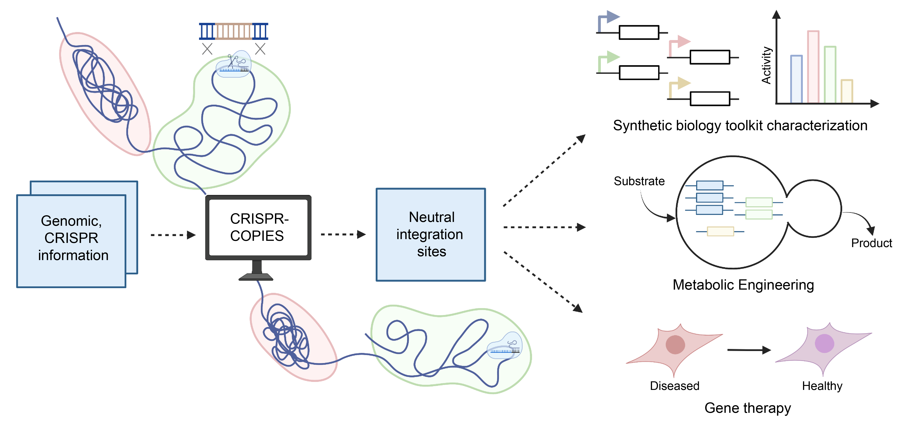

# CRISPR-COPIES
**CO**mputational **P**ipeline for the **I**dentification of CRISPR/Cas-facilitated int**E**gration **S**ites (`CRISPR-COPIES`) is a user-friendly web application and a command line tool for rapid discovery of neutral integration sites. Designed to work for any organism with a genome in NCBI and for any CRISPR system, `CRISPR-COPIES` can identify neutral sites in a genome-wide manner. The identified sites can be used for characterization of synthetic biology toolkits, rapid strain construction to produce valuable biochemicals, and human gene and cell therapy.



### THE PAPER!
This repository accompanies the work ["CRISPR-COPIES: An in silico platform for discovery of neutral integration sites for CRISPR/Cas-facilitated gene integration"](https://www.google.com).

### Web Application
You can use `CRISPR-COPIES` through our web interface. Visit us at [CRISPR-COPIES](https://biofoundry.web.illinois.edu/copies/). 

Note: We have restricted the web interface to prokaryotic and small eukaryotic genomes. We advise you to use our command line option for genomes greater than 120 Mb in size as significant time and computation resources are required. 

### Command Line Tool

- [Installation](#installation)
- [Usage](#usage)
- [Documentation](#documentation)

### Installation
```
conda create --name crispr_copies python=3.8
conda activate crispr_copies
pip install -r requirements38.txt
```
### Usage

`CRISPR-COPIES` can also be accessed using the command line. For information on parameters, run
```
python code/main.py -h
```
A sample example to run the script - 
```
python code/main.py -g s288c/GCF_000146045.2_R64_genomic.fna -t s288c/GCF_000146045.2_R64_feature_table.txt -p NGG -o 3prime -l 20 -sl 10 --edit_dist 6 --intspace 350 -out s288c/output.csv --distal_end_len 10000 -hr_l 50 --protein_file s288c/GCF_000146045.2_R64_protein.faa
```

### Documentation
Detailed information and sample values of parameters for different organisms is provided [here](https://biofoundry.web.illinois.edu/copies/docs).


### Reference
<details>
<summary>If you use this tool, please cite us:</summary>

```bibtex

```
</details>
